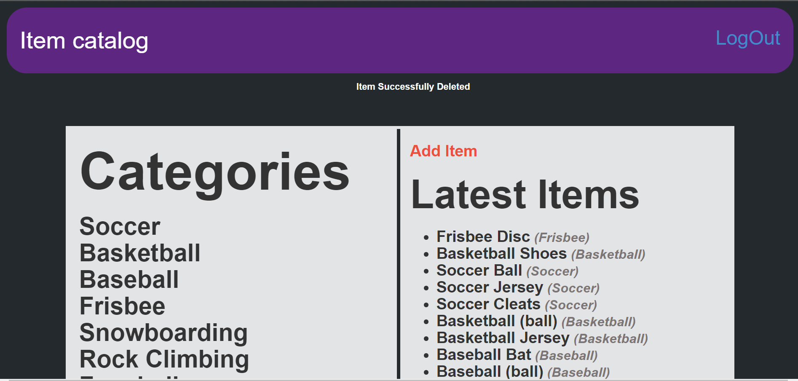

# Item Catalog

A user of this project can add, edit, and delete items belonging to a particular category and to that User too.  
Authentication is handled by Google and Facebook OAuth2.0

# Installing
To download and install this program, you will need git installed.
Open CLI in you system, enter:
```
$ git clone https://github.com/Aadit-Bhojgi/Item-Catalog.git
$ cd /Item-catalog
```

# Google Authentication Services
You need to supply a client_secrets.json file. You can create an application to use
Google's OAuth service at <a href="https://console.developers.google.com.">`https://console.developers.google.com`</a>
and add your Client Id in `login.html` for Google LogIn.

# Facebook Authentication Services
Just like Before, you need to supply a fb_client_secrets.json file. You can create an application to use
Facebook's OAuth service at <a href="https://developers.facebook.com">`https://developers.facebook.com`</a>

# Initializing Database and Populating it with Rows
To initialize the database with empty tables enter:
```
$ python sports_database.py
```
To populate the database with rows:
```
$ python catalog_items.py
Nice, Database Populated!
```

# Starting Application
To start the application enter:
```
$ python catalog.py
* Running on http://0.0.0.0:8000/
* Restarting with reloader
```

Then, go to you browser and type `https://localhost:8000/`

## Below is the Main Page:

